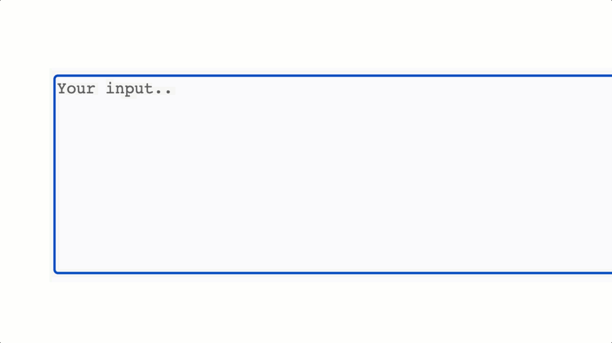

# predict-input 
Learn how to build a predict-input with Vue.js. A predict-input is an inline typeahead with tab completion designed to integrate with a predictive API.

## Course

### Resources

- [Django x Vue.js](https://www.codingforentrepreneurs.com/courses/django-vuejs-3/)
- [Github Code](https://github.com/codingforentrepreneurs/predict-input)